# Symbolic Function Graphing


[![Platform: Squeak 2.8alpha](https://img.shields.io/badge/platform-Squeak%202.8alpha-4B6B8A?logo=data:image/svg%2bxml;base64,PHN2ZyB4bWxucz0iaHR0cDovL3d3dy53My5vcmcvMjAwMC9zdmciIGhlaWdodD0iODAwIiB3aWR0aD0iMTIwMCIgdmVyc2lvbj0iMS4wIiB2aWV3Qm94PSItMjU2NS41OTQ3NSAtMjkxNy4yMjYyNSAyMjIzNS4xNTQ1IDE3NTAzLjM1NzUiPjxwYXRoIGQ9Ik0xMTUwMS4yMTIgNjQ1Ni42MmMuMjg0IDY2My4yNjgtNDMxLjMzIDEyMDEuMTQtOTYzLjg1NCAxMjAxLjE0LTUzMi41MjIgMC05NjQuMTM3LTUzNy44NzItOTYzLjg1My0xMjAxLjE0LS4yODQtNjYzLjI2NiA0MzEuMzMxLTEyMDEuMTM4IDk2My44NTMtMTIwMS4xMzggNTMyLjUyNCAwIDk2NC4xMzggNTM3Ljg3MiA5NjMuODU0IDEyMDEuMTM5eiIvPjxwYXRoIGQ9Ik0xMTIzNC42MjUgNjMzNy4zODdjMCAzMTkuMjQyLTE1Mi44NDEgNTc4LjA0LTM0MS4zOCA1NzguMDQtMTg4LjUzNSAwLTM0MS4zNzYtMjU4Ljc5OC0zNDEuMzc2LTU3OC4wNCAwLTMxOS4yNDEgMTUyLjg0MS01NzguMDQgMzQxLjM3Ni01NzguMDQgMTg4LjUzOSAwIDM0MS4zOCAyNTguNzk5IDM0MS4zOCA1NzguMDR6IiBmaWxsPSIjMDAwMDAwIi8+PHBhdGggZD0iTTc1NjUuMTI5IDYyNzguOTA0YzAgNjYzLjAxOC00MzEuNTMyIDEyMDAuNS05NjMuODUzIDEyMDAuNS01MzIuMzIzIDAtOTYzLjg1NS01MzcuNDgyLTk2My44NTUtMTIwMC41IDAtNjYzLjAyIDQzMS41MzItMTIwMC41MDIgOTYzLjg1NS0xMjAwLjUwMiA1MzIuMzIgMCA5NjMuODUzIDUzNy40ODMgOTYzLjg1MyAxMjAwLjUwMnoiLz48cGF0aCBkPSJNNzI5OC41NDIgNjE2MC4xMjNjMCAzMTguOTk2LTE1Mi44NCA1NzcuNTktMzQxLjM3OSA1NzcuNTktMTg4LjUzNiAwLTM0MS4zNzctMjU4LjU5NC0zNDEuMzc3LTU3Ny41OSAwLTMxOC45OTUgMTUyLjg0LTU3Ny41OSAzNDEuMzc3LTU3Ny41OSAxODguNTM5IDAgMzQxLjM4IDI1OC41OTUgMzQxLjM4IDU3Ny41OXoiIGZpbGw9IiMwMDAwMDAiLz48cGF0aCBkPSJNNTg5MC40MDQgMzczMS4wMTJDMjkwMi4zNjQtMTk1OC43OCA2MTIuNTEtODMyLjU3MSAyODA3LjU0NiA2NTc1LjQwMm04MzA2LjQ4OS0yOTA0LjIzNGMyNzcwLjc2NC01MzU2LjY0IDUzNzYuNzI1LTQ5ODYuMTA4IDMwODIuODU4IDI4NDUuMjk2IiBmaWxsPSJub25lIiBzdHJva2U9IiNmZmYiIHN0cm9rZS13aWR0aD0iMTUwIi8+PHBhdGggZD0iTTk4MTYuNTE1IDkzNTUuNDEzYzAgNDk5LjI3Mi01MzcuNDg0IDkwNC4wMS0xMjAwLjUwMiA5MDQuMDEtNjYzLjAxOCAwLTEyMDAuNTAxLTQwNC43MzgtMTIwMC41MDEtOTA0LjAxIDAtNDk5LjI3IDUzNy40ODMtOTA0LjAxIDEyMDAuNS05MDQuMDEgNjYzLjAyIDAgMTIwMC41MDMgNDA0Ljc0IDEyMDAuNTAzIDkwNC4wMXoiLz48cGF0aCBkPSJNNjg5Ny43NzQgODgyNi43OTRDNDg3OS44IDgyOTQuOTY1IDI4MjMuNTg3IDgyODAuNzk0IDIzIDkxODMuMTM3bTY3NTYuOSAyMzQuODQxYy0yNDg1LjQ2NC0xNTYuNjkzLTQyMDguNTk2LTE5OS4zMjUtNjI4Mi42ODMgMTQyMy41NTRtNjI4Mi42ODMtNDczLjMwOWMtMjE0My4wMTctMjg4LjE3OC0yOTY1LjM0OC05OS44NDQtNDI2Ny45NDUgMTA2OC4xMm03Njk0LjQ1MS0yNDMwLjkyNGMyODk2LjExMi03NDkuMzc0IDUwMjkuNTkyLTIwNi43MzMgNjg3NS42NzkgMzU2LjM0Mm0tNjc1Ni44OTkgMjM1Ljc0OGMyNjU2LjA1LTE5OS4zMjUgNDIzMy4wNTgtMTI4LjQ4IDYyODIuNjgzIDE0MjIuNjQ4bS02MjgyLjY4My00NzUuMTIzYzIwMTkuMTA0LTI1My41NjQgMjg4NS4wNjQtMTc2LjIxMiA0MjY3Ljk0NSAxMDY4LjExOSIgZmlsbD0ibm9uZSIgc3Ryb2tlPSIjZmZmIiBzdHJva2Utd2lkdGg9IjE1MCIvPjwvc3ZnPg==)](https://squeak.org/)
[](https://en.wikipedia.org/wiki/Smalltalk)
[](LICENSE)

An archived Squeak change set demonstrating symbolic expressions, symbolic differentiation, N-dimensional functions, transformations, and real-time 4D graphing.

## Cartesian:

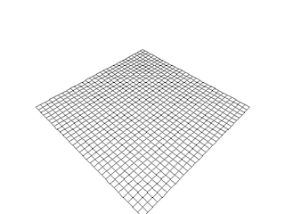
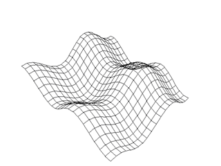
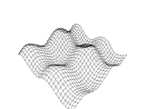

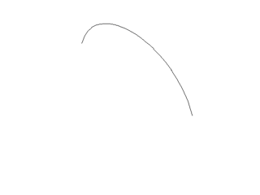
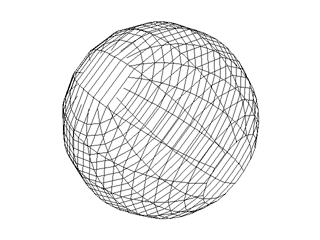


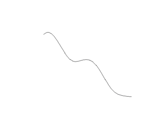
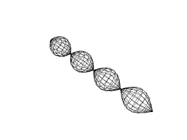

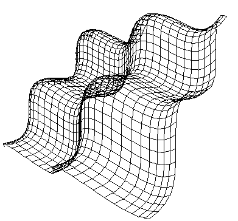
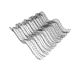


## Polar:

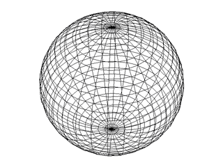

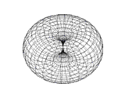


## Contents

The change set includes:

- Symbolic mathematical expressions
- Expression evaluation and symbolic differentiation
- Constants and variables
- Arithmetic, exponential, logarithmic, and trigonometric expressions
- Two-, three-, and four-dimensional functions
- Polar and cylindrical coordinate functions
- Function transformations and rotations
- Real-time graphing of 4D functions

## Historical Context

This project was developed for Squeak 2.8alpha around 2000. It is preserved as an example of exploratory mathematical programming in Smalltalk and is not under active development.

The `.cs` file is a Squeak change set, not C# source code.

## Loading the Change Set

1. Open the project in a compatible Squeak image.
2. Import or file in the change set:

   ```text
   Expression-FunctionNd-FunctionGraph-4DgraphingInRealtime.1.cs
