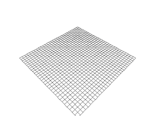
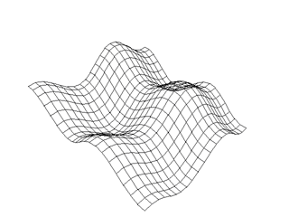
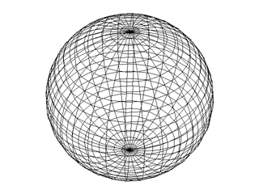
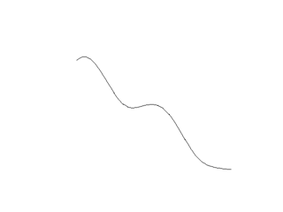
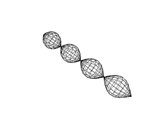
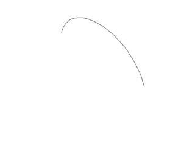
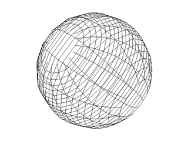
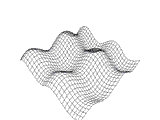
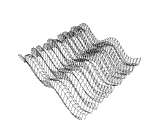
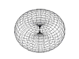

[](https://github.com/redgreenshift/XYZ-3d-graphing-utility/blob/main/README.md)
[](https://github.com/redgreenshift/Greenshift/blob/main/README.md)

# 4D Symbolic Function Graphing

[![Platform: Squeak](https://img.shields.io/badge/Squeak-F8F8F8?logo=)](https://squeak.org/)
[](https://en.wikipedia.org/wiki/Smalltalk)
[](LICENSE)

An archived Squeak/Smalltalk `change set`—a self-contained collection of Smalltalk code—demonstrating symbolic expression evaluation, symbolic differentiation, N-dimensional functions, transformations, and real-time 4D graphing.

Its expressions can be evaluated numerically using supplied variable values, while its differentiation operations produce new symbolic expressions rather than numeric results.

It runs on the [Squeak](https://squeak.org/) platform, which uses a _dialect_ of the [Smalltalk-80 programming language](https://wiki.squeak.org/squeak/373).

## Examples

<p><table border="1">
<tr><td>Plane</td><td>3D Sine curve</td><td>3D polar graph</td></tr>
<tr><td></td><td></td><td></td></tr>
<tr><td>z(x,y) = 0</td><td>z(x,y) = sin(x) + sin(y)</td><td>r(&theta;, &phi;) = 3</td></tr>
</table>

<p><table border="1"><tr><td>2D Function (in 3d space)</td><td>2D Function + Transform = 3D Graph</td></tr>
<tr><td></td><td></td></tr>
<tr><td>y(x) = sin(x)</td><td><code>FunctionTransform</code> rotates it about the x-axis</td></tr>
<tr><td></td><td></td></tr>
<tr><td>y(x) = (25 - x^2)^0.5</td><td><code>FunctionTransform</code> rotates it about the x-axis</td></tr>
</table>


<table bgcolor="#ffffff" border="1">
   <tr bgcolor="#000000">
      <td>4D Function</td>
   <td></td>
   <td></td>
   <td></td>
   </tr>
<tr>
   <td>&nbsp;</td>
   <td>z(x,y,t) = sin(x) + sin(t + y)</td>
   <td>z(x,y,t) = sin(t + x) + sin(t * y)</td>
   <td>r(&theta;,&phi;,t) = sin(&phi;) - sin(t)</td>
</tr>

<tr>
   <td>4D Function + Transform</td>
   <td></td>
   <td></td>
   <td></td>
</tr>

<tr bgcolor="#000000">
   <td>&nbsp;</td>
   <td><code>FunctionTransformTwist</code></td>
   <td><code>FunctionTransformTurn</code></td>
   <td><code>FunctionTransformTilt</code></td>
</tr>
</table>

### Miscellaneous 4D functions
<table bgcolor="#ffffff" border="1">
<tr>
   <td></td>
   <td></td>
   <td></td>
</tr>
<tr bgcolor="#000000">
   <td>r(&theta;,&phi;,t) = 3</td>
   <td>r(&theta;,&phi;,t) = (10 sin(t &theta;) * sin(t &phi;))<sup>&frac12;</sup></td>
   <td>r(&theta;,&phi;,t) = &theta;</td>
</tr>

<tr>
   <td></td>
   <td></td>
   <td></td>
</tr>
<tr bgcolor="#000000">
   <td>r(&theta;,&phi;,t) = (10 sin(&theta; 2t) * sin(&phi; 2t))<sup>&frac12;</sup></td>
   <td>r(&theta;,&phi;,t) = (10 sin(t &theta;) * sin(t &phi;))<sup>&frac12;</sup></td>
   <td>z(x,y,t) = (30 - x<sup>2</sup> - y<sup>2</sup> - t<sup>2</sup>)<sup>&frac12;</sup></td>
</tr>
</table>


## Contents

The change set includes:

- Symbolic mathematical expressions
- Expression evaluation and symbolic differentiation
- Constants and variables
- Arithmetic, exponential, logarithmic, and trigonometric expressions
- Two-, three-, and four-dimensional functions
- Polar and cylindrical coordinate functions
- Function transformations and rotations
- Real-time graphing of 4D functions

## Loading the Change Set

1. Open the project in a compatible Squeak image.
2. Import or file in the change set:

   ```text
   Expression-FunctionNd-FunctionGraph-4DgraphingInRealtime.1.cs

## Project History

This project was developed using Squeak 2.8alpha around 2000. It is preserved as an example of exploratory mathematical programming written in Smalltalk-80 and is **not under active development**. It may require modifications to work with current Squeak versions, but it is expected to work without modification in a Squeak 2.8 environment.

The `.cs` file is a Squeak change set, not C# source code.

### Successor Projects

[`Greenshift`](https://github.com/redgreenshift/Greenshift) is the direct successor to `4D Symbolic Function Graphing`. The original plan was to rewrite `XYZ` in Visual C++, using DirectX, in 4 dimensions, as a **screensaver**. However, I ran into complications when trying to design a more robust expression engine that could support symbolic manipulation and evaluation, so I took a detour through the Smalltalk-80 programming language, writing a 4D graphing utility in Squeak/Smalltalk first. Using what I learned, I was able to complete the robust Expression engine in C++ and decided to make a Winamp visualization instead of a simple "screensaver"

### Predecessor Projects

[`XYZ - 3D Graphing Utility`](https://github.com/redgreenshift/XYZ-3d-graphing-utility) is the direct precursor to `4D Symbolic Function Graphing`, as the fourth dimension is the next logical step, and I wanted to design a more robust expression engine that could support symbolic manipulation and evaluation, which could be much more extensible than the RPN implementation in `XYZ`.


## License
This project is licensed under the MIT License - see the [`LICENSE`](LICENSE) file for details.
